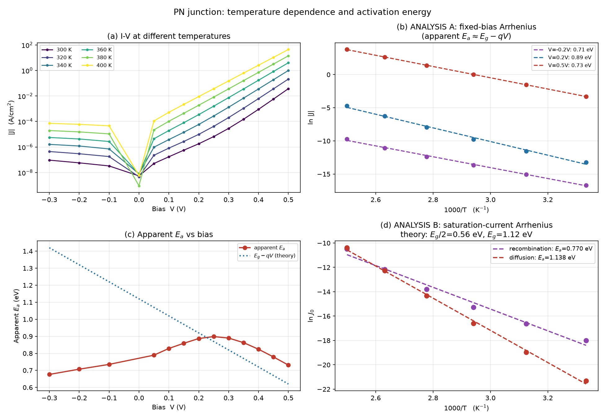

# DEVSIM 半导体器件仿真学习项目

用开源的 TCAD 工具 [DEVSIM](https://github.com/devsim/devsim) 做半导体器件的
**漂移-扩散数值仿真**，从最基础的 PN 结开始，逐步走向薄膜晶体管（TFT）等器件。


---

## 1. 环境（Windows）

| 项 | 值 |
|---|---|
| Python | 3.11.9（虚拟环境在 `.venv/`） |
| DEVSIM | 2.11.0（`pip install devsim`） |
| 数学库 | **Intel MKL 2026.1.0**（`pip install mkl`） |
| 绘图 | numpy + matplotlib |

### ⚠️ Windows 上的关键坑（已解决，务必记录）

DEVSIM 是数值求解器，**必须依赖 BLAS/LAPACK 数学库**。在 Windows 上直接
`pip install devsim` 后会报错：

```
Error loading math libraries. Please install a suitable BLAS/LAPACK library
and set DEVSIM_MATH_LIBS. Alternatively, install the Intel MKL.
Windows returned error 126 while trying to load "libopenblas.dll"
```

**解决两步：**

1. 装 MKL：`pip install mkl`
   → DLL 落在 `.venv\Library\bin\mkl_rt.3.dll`

2. 写一个 `.pth` 文件让 Python 启动时自动设置环境变量
   （`.venv\Lib\site-packages\devsim_mkl.pth`）：

   ```python
   import os; os.environ.setdefault("DEVSIM_MATH_LIBS", r"D:\devsim\.venv\Library\bin\mkl_rt.3.dll")
   ```

   注意：DEVSIM 的提示说"最高测试版本 mkl_rt.**2**.dll"，但实测
   **mkl_rt.3.dll 可以正常加载**，而且会启用 PARDISO 稀疏求解器：

   ```
   Loading "mkl_rt.3.dll": Intel MKL with PARDISO LOADED
   ```

---

## 2. 目录结构

```
D:\devsim\
├── .venv\                       # 独立虚拟环境（含 MKL，已被 .gitignore 排除）
├── ref\                         # DEVSIM 官方示例（第三方，含来源与许可证说明）
│   ├── README.md
│   ├── official_diode_1d.py
│   └── diode_common.py
├── sim\                         # 自己写的仿真脚本
│   ├── 01_diode_iv.py           # 实验一：I-V 特性 + 理想因子提取
│   ├── 02_T_single.py           # 实验三：单温度仿真（含 n_i(T) 修正）
│   ├── 02_temperature_sweep.py  # 实验三：温度扫描 + 激活能提取
│   └── 03_compare_lifetime.py   # 实验二：寿命对比 + 电流成分分解
├── results\                     # 产出：CSV 数据 + PNG 图
├── docs\
│   └── 如何看仿真输出.md         # 方法论：怎么读 DEVSIM 的输出
├── 运行-二极管仿真.cmd            # 双击即可运行的实验启动器
├── 运行-寿命对比实验.cmd
├── 一键提交并推送.cmd             # 双击即可提交并推送
├── 检查环境.cmd
├── 打开-Python终端.cmd
└── README.md
```

### 三次实验一览

| # | 实验 | 脚本 | 核心结论 |
|---|---|---|---|
| 1 | PN 结 I-V 特性 | `01_diode_iv.py` | 理想因子 n 随偏压从 1.46 降到 1.03 |
| 2 | 少子寿命对比 | `03_compare_lifetime.py` | 复合电流占比从 93% 降到 0.5% |
| 3 | **温度扫描 + 激活能** | `02_temperature_sweep.py` | **扩散区 Ea=1.14 eV≈Eg；复合区 Ea=0.60 eV≈Eg/2** |

---

## 3. 怎么运行

```powershell
D:\devsim\.venv\Scripts\python.exe D:\devsim\sim\01_diode_iv.py
```

---

## 4. 器件结构（01_diode_iv.py）

**⚠️ 单位说明（重要）**：DEVSIM 的 `simple_physics` 模块使用**厘米制**
（由常数反推：`eps_0 = 8.85e-14 F/cm`、`n_i = 1e10 cm⁻³`、`mu = 400 cm²/V·s`），
所以网格里的 `pos=1e-5` 意思是 **1e-5 cm = 100 nm**，不是 10 µm。

```
      p 型 (受主 1e18 cm-3)        n 型 (施主 1e18 cm-3)
  x=0 ├──────────────────────────┼──────────────────────────┤ x=1e-5 cm
      top 电极                  结面 0.5e-5 cm            bot 电极
                              (= 50 nm)
```

- 一维网格：总长 **100 nm**，结面在 50 nm 处，结区加密
- 物理模型：泊松方程 + 电子/空穴连续性方程（漂移-扩散）
- 少子寿命 τn = τp = 1e-8 s，T = 300 K
- 偏压扫描：-0.4 V → +0.6 V，共 39 个点，**全部收敛**

> **物理自检**：用短基区二极管公式反算 J(0.6V) — 按 100 nm 算得 0.4 A/cm²，
> 与实测 0.8 A/cm² 同量级；按 10 µm 算只有 0.004 A/cm²，差 200 倍。
> 这从物理上确认了单位是厘米。

---

## 5. 结果


**正向电流密度：**

| 偏压 | J (A/cm²) |
|---|---|
| 0.2 V | 1.14e-06 |
| 0.4 V | 4.49e-04 |
| 0.6 V | 7.99e-01 |

**理想因子 n（由 ln(J) 对 V 的斜率提取，n = 1/(V_T · slope)，V_T = 25.85 mV）：**

| 偏压区间 | 理想因子 n | 物理含义 |
|---|---|---|
| 0.15 – 0.35 V | **1.46** | 低偏压，SRH 复合电流占比大 |
| 0.40 – 0.55 V | **≈1.03** | 高偏压，扩散电流主导，接近理想二极管 |

### 结论

1. **n 随偏压从 1.46 降到 1.03**：这不是数值误差，而是**电流机制的转变**——
   低偏压时耗尽区内的 SRH 复合电流占主导（n 偏大），高偏压时注入扩散电流
   占主导（n → 1）。这与半导体器件物理的理论预期一致。
2. **电流守恒**：两个电极的电流大小相等、符号相反（`I_top ≈ -I_bot`），
   验证了求解结果的物理自洽性。
3. **反向饱和**：反向偏压下电流稳定在 ~1e-7 A/cm² 量级，符合理论。

---

## 6. 实验二：少子寿命对电流成分的影响

**目的**：验证"复合电流住在耗尽层、由少子寿命 τ 控制"这个理论。

**做法**：只改一个参数（τ 从 10 ns → 1 µs），其余完全不动（控制变量法）。

| | τ = 10 ns | τ = 1 µs |
|---|---|---|
| 低偏压区理想因子 n（0.15–0.35 V） | 1.455 | **1.036** |
| 高偏压区理想因子 n（0.40–0.55 V） | 1.038 | 1.036 |
| J @ 0.2 V | 1.1363e-06 | **1.9805e-07**（↓5.7×） |
| J @ 0.4 V | 4.4875e-04 | 3.9390e-04（↓12%） |
| J @ 0.6 V | 7.9853e-01 | 7.9489e-01（**几乎不变**） |


### 电流成分分解（本实验的核心成果）

利用 τ 只影响复合电流这一点，两组数据相减即可把总电流拆成两个分量：

```
J(τ=10ns) = J_diff + J_rec
J(τ=1µs)  = J_diff + J_rec/100
  ⇒  J_rec  = (J_10ns − J_1µs) / (1 − 1/100)
```

分解结果：

| 偏压 | 复合电流占比 |
|---|---|
| 0.10 V | 92.9 % |
| **0.20 V** | **83.4 %** |
| 0.30 V | 45.3 % |
| **0.40 V** | **12.3 %** |
| 0.50 V | 2.4 % |
| **0.60 V** | **0.5 %** |

### 结论

1. **复合电流占比从 93% 单调降到 0.5%** —— 这直接解释了理想因子 n 从 ~1.45（复合主导）变化到 ~1.04（扩散主导）。
2. **两组曲线在高偏压区重合**：说明扩散电流**不受 τ 影响**。原因：本器件半长只有 **50 nm**，而 τ=10 ns 时的扩散长度约 **3.2 µm**（L=√(Dτ)，D=V_T·µ_n≈10.3 cm²/s）——器件比扩散长度**短 64 倍**，属于深度**短基区**器件，扩散电流完全由几何尺寸决定，与寿命无关。这解释了为什么 0.6 V 处的电流几乎没有变化。
3. 图中紫色虚线（复合分量）的**斜率明显比绿色虚线（扩散分量）平缓**，这正是 n≈2 与 n≈1 在图像上的直接体现。

---

## 7. 实验三：温度扫描与激活能提取（Arrhenius 分析）

**目的**：通过电流的温度依赖，反推主导电流机制的**激活能**，验证器件物理。

### ⚠️ 先修正官方示例的一个缺陷

DEVSIM 官方示例的 `SetSiliconParameters(device, region, T)` 里，
**本征载流子浓度 `n_i` 是常数，不随温度变化**（源码中甚至留有
`TODO: make T a free parameter and T dependent parameters as models`）。

但 `n_i` 恰恰是温度效应最强的参数——它按 `exp(-Eg/2kT)` 指数变化。
如果不修正，温度扫描就只剩 `V_t = kT/q` 的微弱变化，完全没有物理意义。

**本项目的修正**（`sim/02_T_single.py`）：

```python
n_i(T) = 1.45e10 * (T/300)^1.5 * exp( Eg/(2k) * (1/300 - 1/T) )
```

验证：n_i(300K)=1.45e10、n_i(350K)=4.0e11、n_i(400K)=5.0e12，**与文献值一致**。

### 分析方法 A：固定偏压下的"表观激活能"

直接对固定偏压下的电流做 `ln J ~ 1/T` 拟合：

| 偏压 | 表观 Ea | R² |
|---|---|---|
| −0.30 ~ −0.10 V | 0.68 – 0.74 eV | >0.995 |
| 0.25 V | **0.90 eV**（峰值） | 0.998 |
| 0.50 V | 0.73 eV | 1.000 |

**结果不符合"低偏压 Eg/2、高偏压 Eg"的简单预期**——因为固定电压时，
`exp(qV/kT)` 这一项本身也随温度变化，会污染表观激活能。

### 分析方法 B：提取饱和电流 J₀（★ 正确方法）

在**每个温度下**拟合 `ln J = ln J₀ + V/(n·V_T)`，把电压外推到 0 得到 `J₀(T)`，
再对 `J₀` 做 Arrhenius 分析：

| 区域 | 拟合区间 | J₀ 激活能 | 理论值 | R² |
|---|---|---|---|---|
| **扩散区** | 0.30 – 0.50 V | **1.138 eV** | **Eg = 1.12 eV** | **0.998** ✅ |
| 复合区（全温度） | 0.05 – 0.25 V | 0.770 eV | Eg/2 = 0.56 eV | 0.983 |
| **复合区（仅 300–340 K）** | 0.05 – 0.25 V | **0.597 eV** | **Eg/2 = 0.56 eV** | **0.999** ✅ |



### ⭐ 关键发现：为什么"复合区"用全温度会得到 0.77 eV？

看复合区的理想因子 n 随温度的变化：

| 温度 | 300 K | 320 K | 340 K | 360 K | 380 K | 400 K |
|---|---|---|---|---|---|---|
| n（0.05–0.25 V 区间） | **1.604** | 1.403 | 1.220 | 1.101 | 1.036 | **1.004** |

**n 从 1.60 降到 1.00** —— 说明在高温下，即使是低偏压区，主导机制也已经从
**复合电流变成扩散电流**了。

物理原因：`J_diff ∝ n_i²` 而 `J_rec ∝ n_i`。温度升高时 n_i 指数增长，
**扩散电流增长得更快**（平方 vs 一次），所以它抢占了越来越宽的偏压范围。

**因此用固定电压窗口跨全温度范围做分析，会把两种机制混在一起**，
得到介于 Eg/2 和 Eg 之间的假值（0.77 eV）。
只取复合电流真正占主导的低温段（300–340 K），就恢复了理论值 0.597 eV ≈ Eg/2。

### 结论

1. **扩散区激活能 1.138 eV ≈ Eg = 1.12 eV**（误差 1.6%）—— 定量验证了
   扩散电流 ∝ n_i² ∝ exp(−Eg/kT)。
2. **复合区激活能 0.597 eV ≈ Eg/2 = 0.56 eV**（误差 6.6%）—— 验证了
   复合电流 ∝ n_i ∝ exp(−Eg/2kT)。
3. **一个重要的实验方法学教训**：做 Arrhenius 分析时，必须保证**分析区间内
   主导机制不随温度改变**。否则表观激活能是混合值，没有物理意义。
4. 这个"低偏压区在高温下转为扩散主导"的现象，**正是真实器件中
   高温漏电剧增的物理根源**（n_i 指数增长 → 电流指数增长）。

---

## 8. 下一步计划

- [ ] **掺杂浓度扫描**：1e15 ~ 1e20，验证"耗尽区变窄 → 复合电流下降"
- [ ] **换成 MOSFET**：扫氧化层厚度 / 沟道掺杂，观察阈值电压漂移
- [ ] **贴近研究方向**：做"缺陷态密度对薄膜晶体管（TFT）转移曲线的影响"
- [ ] 把 `diode_common` 的网格与方程定义改写进本项目自己的 `sim/device_lib.py`

---

## 9. 参考

- DEVSIM 官方仓库：https://github.com/devsim/devsim
- 官方示例（本项目的起点）：`examples/diode/diode_1d.py`
