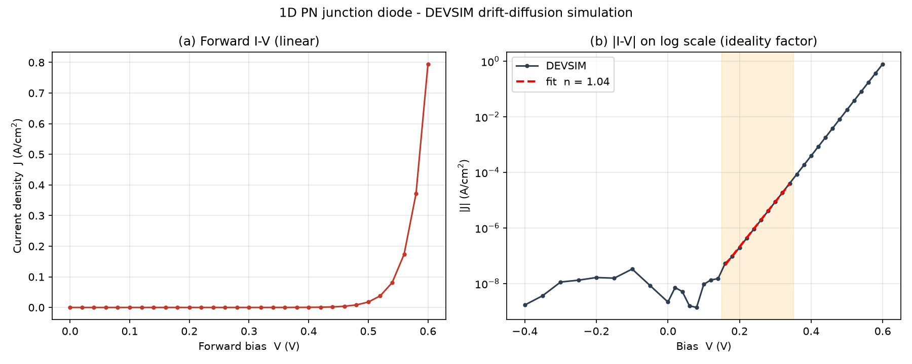
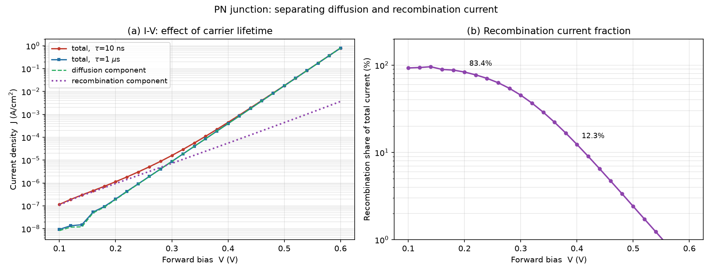

# DEVSIM 半导体器件仿真学习项目

用开源的 TCAD 工具 [DEVSIM](https://github.com/devsim/devsim) 做半导体器件的
**漂移-扩散数值仿真**，从最基础的 PN 结开始，逐步走向薄膜晶体管（TFT）等器件。


---

## 1. 环境（Windows）

| 项 | 值 |
|---|---|
| Python | 3.11.9（虚拟环境在 `.venv/`） |
| DEVSIM | 2.11.0（`pip install devsim`） |
| 数学库 | **Intel MKL 2026.1.0**（`pip install mkl`） |
| 绘图 | numpy + matplotlib |

### ⚠️ Windows 上的关键坑（已解决，务必记录）

DEVSIM 是数值求解器，**必须依赖 BLAS/LAPACK 数学库**。在 Windows 上直接
`pip install devsim` 后会报错：

```
Error loading math libraries. Please install a suitable BLAS/LAPACK library
and set DEVSIM_MATH_LIBS. Alternatively, install the Intel MKL.
Windows returned error 126 while trying to load "libopenblas.dll"
```

**解决两步：**

1. 装 MKL：`pip install mkl`
   → DLL 落在 `.venv\Library\bin\mkl_rt.3.dll`

2. 写一个 `.pth` 文件让 Python 启动时自动设置环境变量
   （`.venv\Lib\site-packages\devsim_mkl.pth`）：

   ```python
   import os; os.environ.setdefault("DEVSIM_MATH_LIBS", r"D:\devsim\.venv\Library\bin\mkl_rt.3.dll")
   ```

   注意：DEVSIM 的提示说"最高测试版本 mkl_rt.**2**.dll"，但实测
   **mkl_rt.3.dll 可以正常加载**，而且会启用 PARDISO 稀疏求解器：

   ```
   Loading "mkl_rt.3.dll": Intel MKL with PARDISO LOADED
   ```

---

## 2. 目录结构

```
D:\devsim\
├── .venv\              # 独立虚拟环境（含 MKL）
├── ref\                # DEVSIM 官方示例（参考，未修改）
│   ├── official_diode_1d.py
│   └── diode_common.py
├── sim\                # 自己写的仿真脚本
│   └── 01_diode_iv.py
├── results\            # 产出：CSV 数据 + PNG 图
│   ├── diode_iv.csv
│   └── diode_iv.png
└── README.md
```

---

## 3. 怎么运行

```powershell
D:\devsim\.venv\Scripts\python.exe D:\devsim\sim\01_diode_iv.py
```

---

## 4. 器件结构（01_diode_iv.py）

```
       p 型 (受主 1e18 cm-3)        n 型 (施主 1e18 cm-3)
  x=0 ├──────────────────────────┼──────────────────────────┤ x=10 um
       top 电极                  结面 x=5um               bot 电极
```

- 一维网格，长度 10 µm，结面在 5 µm，结区加密（1e-9 m）
- 物理模型：泊松方程 + 电子/空穴连续性方程（漂移-扩散）
- 少子寿命 τn = τp = 1e-8 s，T = 300 K
- 偏压扫描：-0.4 V → +0.6 V，共 39 个点，**全部收敛**

---

## 5. 结果



**正向电流密度：**

| 偏压 | J (A/cm²) |
|---|---|
| 0.2 V | 1.14e-06 |
| 0.4 V | 4.49e-04 |
| 0.6 V | 7.99e-01 |

**理想因子 n（由 ln(J) 对 V 的斜率提取，n = 1/(V_T · slope)，V_T = 25.85 mV）：**

| 偏压区间 | 理想因子 n | 物理含义 |
|---|---|---|
| 0.15 – 0.35 V | **1.46** | 低偏压，SRH 复合电流占比大 |
| 0.40 – 0.55 V | **≈1.03** | 高偏压，扩散电流主导，接近理想二极管 |

### 结论

1. **n 随偏压从 1.46 降到 1.03**：这不是数值误差，而是**电流机制的转变**——
   低偏压时耗尽区内的 SRH 复合电流占主导（n 偏大），高偏压时注入扩散电流
   占主导（n → 1）。这与半导体器件物理的理论预期一致。
2. **电流守恒**：两个电极的电流大小相等、符号相反（`I_top ≈ -I_bot`），
   验证了求解结果的物理自洽性。
3. **反向饱和**：反向偏压下电流稳定在 ~1e-7 A/cm² 量级，符合理论。

---

## 6. 实验二：少子寿命对电流成分的影响

**目的**：验证"复合电流住在耗尽层、由少子寿命 τ 控制"这个理论。

**做法**：只改一个参数（τ 从 10 ns → 1 µs），其余完全不动（控制变量法）。

| | τ = 10 ns | τ = 1 µs |
|---|---|---|
| 低偏压区理想因子 n（0.15–0.35 V） | 1.455 | **1.036** |
| 高偏压区理想因子 n（0.40–0.55 V） | 1.038 | 1.036 |
| J @ 0.2 V | 1.1363e-06 | **1.9805e-07**（↓5.7×） |
| J @ 0.4 V | 4.4875e-04 | 3.9390e-04（↓12%） |
| J @ 0.6 V | 7.9853e-01 | 7.9489e-01（**几乎不变**） |



### 电流成分分解（本实验的核心成果）

利用 τ 只影响复合电流这一点，两组数据相减即可把总电流拆成两个分量：

```
J(τ=10ns) = J_diff + J_rec
J(τ=1µs)  = J_diff + J_rec/100
  ⇒  J_rec  = (J_10ns − J_1µs) / (1 − 1/100)
```

分解结果：

| 偏压 | 复合电流占比 |
|---|---|
| 0.10 V | 92.9 % |
| **0.20 V** | **83.4 %** |
| 0.30 V | 45.3 % |
| **0.40 V** | **12.3 %** |
| 0.50 V | 2.4 % |
| **0.60 V** | **0.5 %** |

### 结论

1. **复合电流占比从 93% 单调降到 0.5%** —— 这直接解释了理想因子 n 从 ~1.45（复合主导）变化到 ~1.04（扩散主导）。
2. **两组曲线在高偏压区重合**：说明扩散电流**不受 τ 影响**。原因：本器件半长为 5 µm，而 τ=10 ns 时的扩散长度约 6 µm，属于**短基区**器件——扩散电流由几何尺寸决定，与寿命无关。这解释了为什么 0.6 V 处的电流几乎没有变化。
3. 图中紫色虚线（复合分量）的**斜率明显比绿色虚线（扩散分量）平缓**，这正是 n≈2 与 n≈1 在图像上的直接体现。

---

## 7. 下一步计划

- [ ] **参数扫描**：掺杂浓度（1e15 ~ 1e20）对 I-V 和理想因子的影响
- [ ] **温度扫描**：300 K → 400 K，观察反向饱和电流的温度依赖（提取激活能）
- [ ] **换成 MOSFET**：扫氧化层厚度 / 沟道掺杂，观察阈值电压漂移
- [ ] **贴近研究方向**：做"缺陷态密度对薄膜晶体管（TFT）转移曲线的影响"

---

## 7. 参考

- DEVSIM 官方仓库：https://github.com/devsim/devsim
- 官方示例（本项目的起点）：`examples/diode/diode_1d.py`
